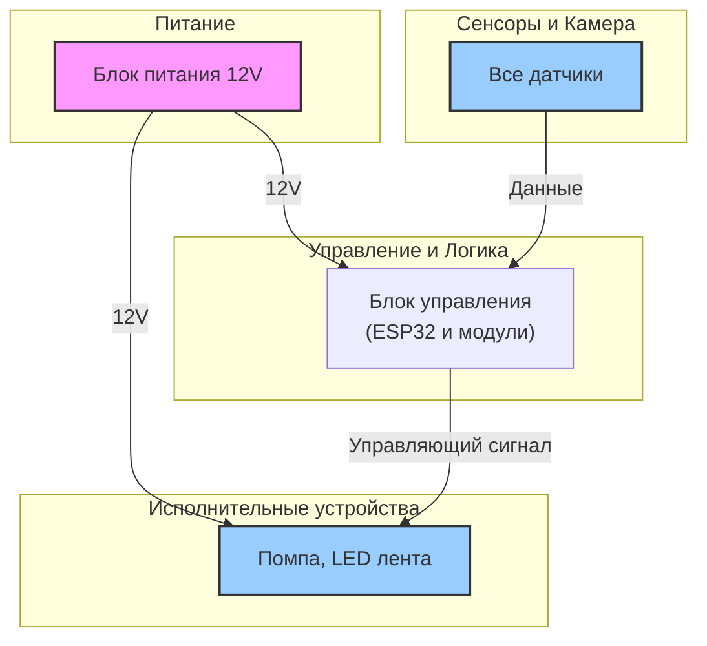
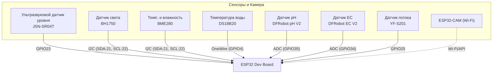
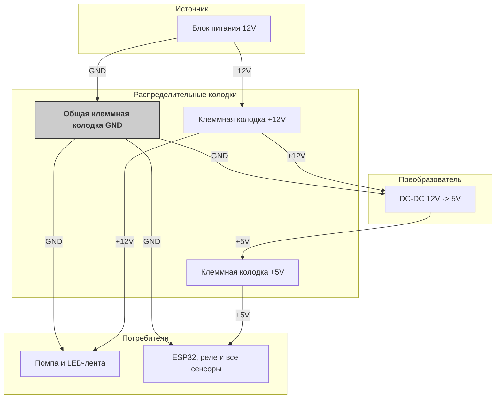

# Концепция проекта "Умная гидропонная башня"

Этот документ описывает концепцию и компоненты для создания умной гидропонной установки башенного типа на базе 3D-модели "Modular Hydroponic Tower Garden" и микроконтроллера ESP32 с прошивкой ESPHome.

## 1. Концепция системы

Система предназначена для автоматизации ключевых процессов в гидропонной установке: контроль и поддержание уровня питательного раствора, управление освещением и мониторинг ключевых параметров воды (EC и pH).

**Принцип работы:**

- **Контроллер ESP32** является "мозгом" системы. Он собирает данные с сенсоров и управляет исполнительными устройствами.
- **Сенсоры** непрерывно или периодически измеряют параметры окружающей среды и питательного раствора.
- **Исполнительные устройства** (помпа и светодиодная лента) включаются по заданным алгоритмам (например, по расписанию или по показаниям датчиков).
- **Питание** всей системы осуществляется от одного блока питания на 12В, что упрощает конструкцию. Специализированная плата расширения или набор модулей обеспечивает распределение питания на все компоненты.
- **ESPHome** позволяет легко настроить всю логику работы через простой конфигурационный YAML-файл без необходимости глубокого программирования.

### Структурная схема

#### 1. Общая архитектура системы

#### 2. Схема подключения сенсоров к ESP32

## 2. Список компонентов для покупки

Ниже приведен список рекомендованных и совместимых компонентов.

| Компонент                     | Назначение                                                 | Пример / Модель                                                              |
| :---------------------------- | :--------------------------------------------------------- | :--------------------------------------------------------------------------- |
| **Управление**                |
| Микроконтроллер               | Мозг системы                                               | ESP32 DEVKIT V1 (или любая плата на ESP-WROOM-32)                            |
| Плата расширения              | Для удобного подключения проводов без пайки                | ESP32 Terminal Adapter / Screw Shield                                        |
| **Питание**                   |
| Блок питания                  | Питание всей установки                                     | AC/DC 12V, 5A (или больше, в зависимости от длины и мощности ленты)          |
| DC-DC Преобразователь         | Понижение напряжения с 12В до 5В для ESP32                 | DC-DC Step-Down Buck Converter (вход 12V, выход 5V 3A+)                      |
| **Сенсоры**                   |
| Ультразвуковой датчик уровня  | Измерение расстояния до воды                               | Ультразвуковой датчик JSN-SR04T                                              |
| Датчик освещенности           | Мониторинг естественного света                             | GY-30 / BH1750 (I2C интерфейс)                                               |
| Датчик темп. и влажн. воздуха | Контроль микроклимата                                      | BME280 (I2C интерфейс)                                                       |
| Датчик температуры воды       | Контроль температуры питательного раствора                 | DS18B20 (в герметичном корпусе)                                              |
| Датчик потока воды            | Контроль работы помпы                                      | YF-S201                                                                      |
| EC-метр                       | Измерение электропроводности раствора (концентрация солей) | DFRobot Gravity: Analog EC Sensor/Meter V2 (K=1.0)                           |
| pH-метр                       | Измерение кислотности раствора                             | DFRobot Gravity: Analog pH Sensor/Meter Pro Kit V2                           |
| **Исполнительные устройства** |
| Освещение                     | Круговая фитолампа                                         | Светодиодная лента 12V, фитоспектр. **Длину нужно подбирать под 3D модель!** |
| Драйвер для LED ленты         | Управление 12В лентой с помощью ESP32                      | MOSFET-модуль (например, IRF520 / AOD4184)                                   |
| Водяная помпа                 | Подача раствора наверх башни                               | Погружная помпа DC 12V, производительность ~240-300 л/ч                      |
| Релейный модуль               | Управление 12В помпой с помощью 5В сигнала от ESP32        | 1-канальный релейный модуль 5V                                               |
| **Видеонаблюдение**           |
| Камера                        | Удаленный мониторинг состояния растений                    | Модуль ESP32-CAM                                                             |
| **Прочее**                    |
| Корпус                        | Защита электроники от влаги                                | IP65/IP67 пластиковый корпус                                                 |
| Провода                       | Соединение компонентов                                     | Jumper wires ( Dupont ), провода сечением 0.5мм²                             |
| Калибровочные растворы        | Для точной настройки pH и EC сенсоров                      | Растворы pH (4.01, 7.00), EC (1413 us/cm, 12.88 ms/cm)                       |
| Клеммные колодки              | Для распределения питания                                  | Винтовые, на 4-8 контактов                                                   |

**Примечание по плате расширения:** Вместо поиска одной сложной платы, которая делает все, я рекомендую модульный подход. Установите ESP32 на плату с винтовыми клеммами (Terminal Adapter). Рядом в том же корпусе разместите мощный DC-DC преобразователь 12V->5V и релейный модуль. Это гибкое, надежное и легко обслуживаемое решение.

### 2.1. Распиновка (Pinout)

В таблице ниже приведена рекомендуемая распиновка для всех компонентов, подключаемых к главной плате ESP32.

| Компонент                         | Тип / Протокол       | Пин на ESP32                   |
| :-------------------------------- | :------------------- | :----------------------------- |
| **Сенсоры**                       |
| Ультразвуковой датчик уровня      | Ultrasonic           | `Trig: GPIO23`, `Echo: GPIO19` |
| Датчик освещенности (BH1750)      | I2C                  | `SDA: GPIO21`, `SCL: GPIO22`   |
| Датчик темп./влажн. (BME280)      | I2C                  | `SDA: GPIO21`, `SCL: GPIO22`   |
| Датчик температуры воды (DS18B20) | One-Wire             | `GPIO4`                        |
| Датчик потока воды (YF-S201)      | GPIO (Pulse Counter) | `GPIO25`                       |
| EC-метр (DFRobot)                 | Analog (ADC)         | `GPIO34`                       |
| pH-метр (DFRobot)                 | Analog (ADC)         | `GPIO35`                       |
| **Исполнительные устройства**     |
| LED лента (через MOSFET)          | PWM                  | `GPIO13`                       |
| Водяная помпа (через реле)        | GPIO (Digital)       | `GPIO12`                       |
| **Камера**                        |
| ESP32-CAM                         | Wi-Fi                | N/A (отдельное устройство)     |

**Что такое АЦП (ADC)?** Это **А**налого-**ц**ифровой **п**реобразователь, встроенный в ESP32. Он нужен для "чтения" показаний с аналоговых датчиков (таких как pH и EC), которые выдают результат в виде изменяющегося напряжения. АЦП преобразует это напряжение в число, понятное микроконтроллеру. Покупать его отдельно не нужно.

### 2.2. Распределение питания

Для такого количества компонентов необходим организованный подход к питанию. Использование клеммных колодок — это лучшее решение, чтобы избежать беспорядка в проводах и обеспечить надежный контакт.

Вся система имеет три основные линии питания: **+12В**, **+5В** и общая **Земля (GND)**. Для правильной работы всех компонентов абсолютно необходимо, чтобы у них была общая "земля" (GND).

- **Линия +12В:** Водяная помпа, Светодиодная лента.
- **Линия +5В:** Плата ESP32, все сенсоры, релейный модуль.
- **Линия GND:** **Все** компоненты системы.

#### Схема организации питания

## 3. Программное обеспечение: ESPHome

ESPHome позволяет описать всю логику работы устройства в одном файле. Вся конфигурация для основного контроллера вынесена в файл `
